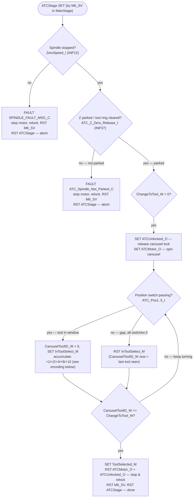
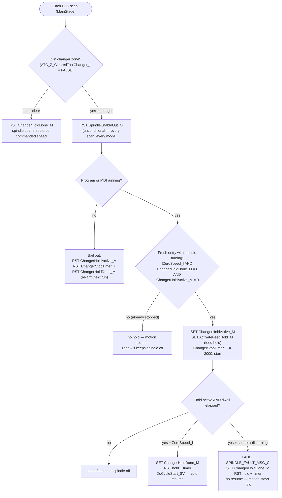

# Acroloc-Centroid

Centroid **CNC12** PLC program and M-code macros for an **Acroloc** mill retrofitted with a
Centroid **ALLIN1DC** motion controller (MPU11-based).

This repo is the controller-level source: a PLC program written in Centroid's stage/ladder
language, plus the M-function macros that the CNC calls. It is compiled and loaded by the
Centroid CNC12 software (`cncm`) on the Windows control PC — there is no build step in this
repository.

## Files

| File | Purpose |
| --- | --- |
| `Centroid-Acroloc-ALLIN1DC.src` | The PLC program (definitions + stages). Primary file. |
| `plc.map` | Generated symbol→source-line map from the PLC compiler. Do not hand-edit. |
| `mfunc3.mac` / `mfunc4.mac` | Spindle start CW / CCW |
| `mfunc6.mac` | Tool change (M6) — drives the custom Acroloc ATC |
| `mfunc7.mac` / `mfunc8.mac` | Coolant: mist / flood |
| `mfunc10.mac` / `mfunc11.mac` | Clamp on / off |

Custom logic added for this machine is tagged with the comment marker `; Acroloc` throughout
the `.src`.

## Spindle speed & range (transmission) shifting

The Acroloc spindle has a **two-speed transmission** (low / high range). The PLC reads which
range the gearbox is in, reports it to the CNC, and scales the analog speed command so the
displayed/commanded RPM matches the gear that is actually engaged.

### Range selection input

The current gear is determined by a single feedback input:

```
SpinLowRange_I   IS INP13        ; transmission-in-low-gear sense switch
```

In the spindle-range logic inside `MainStage`:

```
IF True_M         THEN SpindleRange_W = 4     ; default to HIGH range (fail-safe)
IF SpinLowRange_I THEN SpindleRange_W = 1     ; INP13 active  -> LOW range
```

- **INP13 active → low range** (`SpindleRange_W = 1`)
- **INP13 inactive → high range** (`SpindleRange_W = 4`, the default)

> The stock PLC also defines `SpinMedRange_I (INP14)` and `SpinHighRange_I (INP15)` for
> 4-range gearboxes, but neither is referenced — consistent with this two-speed head.

### Range → speed-scaling ratio

`SpindleRange_W` selects a ratio (`SpinRangeAdjust_FW`) and reports the range to CNC12 via the
`SV_SPINDLE_LOW_RANGE` / `SV_SPINDLE_MID_RANGE` flags:

| `SpindleRange_W` | Range | Ratio source (`SpinRangeAdjust_FW`) |
| --- | --- | --- |
| 1 | Low | `SV_MACHINE_PARAMETER_65` |
| 2 | Med-low | `SV_MACHINE_PARAMETER_66` |
| 3 | Med-high | `SV_MACHINE_PARAMETER_67` |
| 4 | High | `1.0` |

A **negative** ratio parameter reverses the motor (sets `SpinRangeReversed_M`) and the
absolute value is used as the real ratio; the ratio is also floored at `0.001` since the code
later divides by it.

### Speed command → DAC output

Each scan the PLC builds the analog spindle command (`MainStage`):

1. Read configured min/max RPM (`SV_PC_CONFIG_MIN/MAX_SPINDLE_SPEED`) and compute
   `RPMPerBit_FW = MaxSpeed / 4095`.
2. Pick the commanded speed:
   - **Auto mode:** `SpinSpeedCommand_FW = SV_PC_COMMANDED_SPINDLE_SPEED` (override already
     factored in by CNC12).
   - **Manual mode:** `MaxSpeed × (SV_PLC_SPINDLE_KNOB / 200) × SpinRangeAdjust_FW`.
   - Spindle disabled (`!SpindleEnableOut_O`) forces `0`.
3. Clamp to `[MinSpeed × ratio, MaxSpeed × ratio]` (low-clamp posts the "min speed" message).
4. Convert to a 12-bit value: `TwelveBitSpeed_FW = SpinSpeedCommand / RPMPerBit`, then
   **divide by `SpinRangeAdjust_FW` to factor in the gear range**.
5. Bound to `0–4095` and write to the analog output (`WTB TwelveBitSpeed_W SpinAnalogOutBit0_O 12`).

The relevant gear-ratio parameters are set in CNC12's machine parameters (Parameter 65 for the
low range on this machine).

### ⚠️ Not yet implemented: commanding the shift

`INP13` only *senses* the current gear. The two custom outputs intended to actuate the
transmission solenoids are **defined but not driven anywhere** in the PLC:

```
Spindle_Low_gear_O    IS OUT19    ; Acroloc  (high gear must be released)
Spindle_High_gear_O   IS OUT20    ; Acroloc  (low gear must be released)
```

So the PLC currently reacts to the gear position but does not command the shift. Wiring these
outputs into range logic is outstanding work.

## Automatic tool changer (ATC)

The Acroloc uses a **rotary carousel** tool changer. A tool change spans three places:
`mfunc6.mac` (the M6 macro), the ATC kickoff/safety logic in `MainStage`, and the
`ATCStage` (STG16) state machine that actually indexes the carousel. All of this is custom
work tagged `; Acroloc`.

### I/O and variables

| Symbol | Resource | Role |
| --- | --- | --- |
| `M6_SV` | `SV_M94_M95_8` | Tool-change request flag (set by `M94 /8`) |
| `ChangeToTool_W` | `W72` | Target tool number for this change |
| `CarouselToolID_W` | `W71` | Tool currently passing the spindle (decoded live) |
| `ATCMotor_O` | `OUT17` | Spins the tool carousel |
| `ATCUnlocked_O` | `OUT18` | Releases the carousel lock |
| `ATC_Pos1_I`..`ATC_Pos5_I` | `INP32`..`INP28` | 5 carousel position switches |
| `ATC_Z_ClearedToolChanger_I` | `INP26` | Z clearance: **TRUE = clear** (spindle may run), **FALSE = Z in changer** |
| `ATC_Z_Zero_Release_I` | `INP27` | Z axis has cleared the tool ring (parked) |
| `ATCManualUnlock_I` | `INP24` | Manual unlock button on the front of the machine |
| `ZeroSpeed_I` | `INP12` | Spindle at zero RPM |
| `ChangerStopTimer_T` | `T23` | Spindle-stop dwell / timeout for the changer feed-hold interlock |

### Tool change flow

1. **`mfunc6.mac` (M6):** stops the spindle (`S0 M5`) and coolant (`M9`), moves Z to the
   tool-change position with `G53 Z0`, sends the requested tool number with `M107`, then
   sets `M6_SV` via `M94 /8` to start the change and resets it with `M95 /8` once `ATCStage`
   clears. Like every macro here it skips in graph/search mode
   (`IF #4201 || #4202 THEN GOTO 1000`) and ends at `N1000`.

2. **`MainStage` kickoff & safety:** on `M6_SV` it latches the target
   (`ChangeToTool_W = SV_TOOL_NUMBER`) and `SET ATCStage`. The spindle is stopped on the way
   into the changer by the general
   [spindle-in-changer feed-hold interlock](#spindle-in-changer-feed-hold-interlock) — the
   `G53 Z0` park move trips it like any other move into the zone. `ATCStage` then independently
   re-checks before indexing:
   - **Spindle stopped** — `ATCStage` requires `ZeroSpeed_I`; otherwise it raises
     `SPINDLE_FAULT_MSG_C` and aborts.
   - **Z parked** — `ATCStage` also checks `ATC_Z_Zero_Release_I`; if Z hasn't cleared the
     tool ring it raises `ATC_Spindle_Not_Parked_C` and aborts.

   Both aborts clean up fully: stop and relock the carousel (`RST ATCMotor_O`,
   `RST ATCUnlocked_O`), drop the request (`RST M6_SV`, `ChangeToTool_W = 0`), and
   `RST ATCStage` — otherwise the motor would stay energized and `MainStage` would re-arm
   the stage every scan while `M6_SV` was still set.

3. **`ATCStage` indexing:** once safe and `ChangeToTool_W > 0`, it unlocks and spins the
   carousel (`SET ATCUnlocked_O, SET ATCMotor_O`) and decodes the position switches as each
   tool passes.

### ATCStage flow

`ATCStage` will not release or spin the carousel until **both** Z-axis conditions hold: the
spindle is stopped (`ZeroSpeed_I`, INP12) **and** Z is fully parked at the top so the tool ring
is cleared (`ATC_Z_Zero_Release_I`, **INP27**). INP27 is the carousel-release gate — it is the
park position (Z ≈ 0), a higher Z than the changer **danger band** (INP26) that the
[feed-hold interlock](#spindle-in-changer-feed-hold-interlock) acts on. The same INP27 also
gates the front-panel [manual unlock](#manual-unlock).



> ⚠️ The "keep turning" loop has **no timeout** — if `ChangeToTool_W` is never matched the
> carousel spins indefinitely (see the no-carousel-timeout note below).

### Carousel position encoding

Tool IDs are encoded across the 5 position switches as **base-16 written in decimal**. While
the carousel turns, the PLC accumulates `CarouselToolID_W` from whichever switches are active,
then resets to look for the next tool when all switches read 0:

```
ATC_Pos1_I -> +1
ATC_Pos2_I -> +2
ATC_Pos3_I -> +4
ATC_Pos4_I -> +8
ATC_Pos5_I -> +10   ; note: 10, NOT 16 — base-16 encoded as decimal
```

| Tool | Switches (1-2-3-4-5) | Tool | Switches | Tool | Switches |
| --- | --- | --- | --- | --- | --- |
| T1 | `* . . . .` | T5 | `* . * . .` | T9  | `* . . * .` |
| T2 | `. * . . .` | T6 | `. * * . .` | T10 | `. . . . *` |
| T3 | `* * . . .` | T7 | `* * * . .` | T11 | `* . . . *` |
| T4 | `. . * . .` | T8 | `. . . * .` | T12 | `. * . . *` |

When `CarouselToolID_W == ChangeToTool_W`, the PLC stops and relocks the carousel
(`RST ATCMotor_O, RST ATCUnlocked_O`), clears the request (`RST M6_SV`), and ends the change
(`RST ATCStage`).

### Manual unlock

Outside of a tool change, the front-panel `ATCManualUnlock_I` button releases the carousel
lock (`SET ATCUnlocked_O`) provided Z is parked (`ATC_Z_Zero_Release_I`), and posts
`ATC_Lock_Released_C` / `ATC_Lock_Not_Released_C` status messages.

### ⚠️ No carousel timeout

`ATCStage` has no timeout protecting the carousel itself (see the `;TODO` in the source). If
the requested tool is never matched — e.g. an off-by-one in the position decode or a failed
switch — `ATCMotor_O` keeps spinning indefinitely. Take care when editing the match/exit
conditions.

## Spindle-in-changer feed-hold interlock

The spindle must never be turning — not even coasting — while it is inside the tool changer.
Two cooperating rules in `MainStage` enforce this:

- **Unconditional zone-kill** — whenever Z is inside the changer (`!ATC_Z_ClearedToolChanger_I`),
  the spindle enable is dropped every scan, in **all modes**: program, MDI, and manual. A
  jog-panel spindle-start with Z parked in the changer, or jogging Z into the zone with the
  spindle running, is killed the same way. (This keeps the always-on rule of the original
  spindle-stop block that the interlock replaced.)
- **Feed-hold interlock** — for **any** programmed or MDI move that drives Z into the changer
  (not just a tool change) while the spindle is *not yet confirmed stopped*: hold motion,
  wait for the spindle to reach zero, auto-resume. If `ZeroSpeed_I` already reads stopped at
  entry, no hold is taken (the zone-kill still holds the spindle off for the whole visit).

The spindle restarts at its commanded speed once Z clears. `ATCStage` additionally carries its
own zero-speed guard as defense-in-depth (added together with this interlock).

### Signals

| Symbol | Resource | Role |
| --- | --- | --- |
| `ATC_Z_ClearedToolChanger_I` | `INP26` | **TRUE = Z clear** (spindle may run); **FALSE = Z in changer** (danger) |
| `ZeroSpeed_I` | `INP12` | Spindle at zero RPM |
| `SpindleEnableOut_O` | `OUT7` | Spindle enable — dropped every scan Z is in the zone |
| `ActivateFeedHold_M` | `MEM45` | Stock feed-hold trigger (self-clears; the hold is latched by `FeedHoldLED_O` until cycle start) |
| `DoCycleStart_SV` | `SV_PLC_FUNCTION_2` | Cycle start — pulsed to auto-resume |
| `ChangerHoldActive_M` | `MEM448` | Latched while holding feed and waiting for the spindle to stop |
| `ChangerHoldDone_M` | `MEM449` | Once-per-entry latch; cleared only when Z clears the changer |
| `ChangerStopTimer_T` | `T23` | Spindle-stop dwell (Option A) / timeout (Option B) |

### Steps (Option A — default)

1. **Enter the zone** (`!ATC_Z_ClearedToolChanger_I`) during a program/MDI run **with the
   spindle not confirmed stopped** (`!ZeroSpeed_I`) → engage feed hold (`ActivateFeedHold_M`),
   drop the spindle (`RST SpindleEnableOut_O`), and start a **3-second dwell**
   (`ChangerStopTimer_T = 3000`). If `ZeroSpeed_I` already reads stopped at entry (M6 issued
   `M5` well before the Z move, or a run starts with Z parked in the changer), **no hold is
   taken** and motion proceeds immediately.
2. **Spindle stays off the whole time Z is in the zone** — the unconditional zone-kill is
   re-applied every scan, in every mode, so it cannot spin (back) up while inside.
3. **At the end of the dwell:**
   - spindle stopped (`ZeroSpeed_I`) → pulse `DoCycleStart_SV` to **auto-resume**;
   - still turning (`!ZeroSpeed_I`) → raise `SPINDLE_FAULT_MSG_C`, **stay held**, no resume.
4. **Z clears** (`ATC_Z_ClearedToolChanger_I` TRUE) → the spindle seal-in restores the spindle
   at its commanded RPM — unless the program issued `M5` (e.g. inside M6), which keeps it off.

`ChangerHoldDone_M` makes the hold fire **once per entry** (it is set on both the resume and the
fault paths), preventing re-arm/oscillation; it clears when Z leaves the zone **and** on a
program stop/cancel, so a fresh run re-confirms zero speed from scratch instead of trusting a
latch left over from a canceled run. After a stuck-spindle fault, recovery expects Z to be
jogged clear of the changer to re-arm.

### Option B (commented alternative)

The source ships a second variant, commented out, that **waits for the `ZeroSpeed_I` signal**
instead of a fixed dwell — it resumes the instant a stop is confirmed, with a 5-second timeout
→ fault. Switching is a comment swap between the `OPTION A` / `OPTION B` blocks in `MainStage`.
Option A is sensor-light (one zero-speed check at the dwell's end); Option B will not resume
until the sensor confirms a real stop.

### Flow

The interlock is a set of independent rungs evaluated every PLC scan; this chart shows the
resulting per-scan decision flow for the active Option A:


